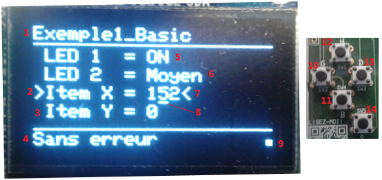

# Librairie TGP MenuOLED

Permet de créer un menu déroulant sur un affichage OLED de type SSD1306. 

Cette librairie est construite sur les librairies [TGP Bouton](https://github.com/TechnoPhysCAL/TGP_Bouton) et n'importe quelle classe implémentant la classe Adafruit_SSD1306, tel que [TGP Ecran](https://github.com/TechnoPhysCAL/TGP_Ecran).


## Notes de version

### 2.0.0 : 
 - La dépendance à ProtoTGP est retiré; seuls les boutons et l'écran sont nécessaires à sont fonctionnement. Les boutons doivent être du type TGP Bouton, tandis que l'écran peut être n'importe quelle instance qui implémente la classe Adafruit_SSD1306.

## Utilisation

## Détails

### Légende 


1.	Ligne réservée pour le Titre du menu avec le souligné en dessous. On modifie le titre à l’aide de la méthode « imprimeLigneTitreOLED »
2.	Le caractère « > » indique l’item du menu présentement sélectionné ; pour éditer sa valeur courante, il faut appuyer sur le bouton SELECTION.
3.	Item de type NUMERIQUE : la valeur courante est un entier. On ajoute un tel item au menu par la méthode « ajouterItemNumerique ».
4.	Ligne réservée pour le Status du menu avec le souligné en dessus. On modifie le status à l’aide de la méthode « imprimeLigneStatusOLED »
5.	Item de type ON-OFF : la valeur courante, « 0 » ou « 1 » est affichée par OFF ou ON. On ajoute un tel item au menu par la méthode « ajouterItemOnOff ».
6.	Item de type TEXTE : la valeur courante sert d’index pour un tableau de chaînes de caractères à afficher.  On ajoute un tel item au menu par la méthode « ajouterItemTexte ».
7.	Le caractère « < » indique que l’item est en mode d’édition. Dans ce mode, on modifie la valeur courante par les boutons HAUT et BAS. On entre et on sort du mode d’édition par le bouton SELECTION.
8.	En mode d’édition de la valeur courante d’un item de type NUMERIQUE, le caractère de soulignement indique le digit incrémenté et décrémenté par les boutons HAUT et BAS. On peut déplacer ce caractère de soulignement par les boutons GAUCHE et DROITE.
9.	Carré clignotant servant de « HeartBeat »
10.	Bouton GAUCHE : sert à déplacer vers la gauche le caractère de soulignement lors de l’édition de la valeur courante d’un item de type NUMERIQUE.
11.	Bouton BAS : sert à se déplacer vers le bas dans le menu déroulant. En mode d’édition, il sert plutôt à diminuer la valeur courante.
12.	Bouton HAUT : sert à se déplacer vers le haut dans le menu déroulant. En mode d’édition, il sert plutôt à augmenter la valeur courante.
13.	Bouton DROITE : sert à déplacer vers la droite le caractère de soulignement lors de l’édition de la valeur courante d’un item de type NUMERIQUE.
14.	Bouton SELECTION sert à entrer et sortir du mode d’édition de la valeur courante de l’item. À la sortie du mode d’édition, la fonction « callback » associée à l’item est automatiquement appelée.

### Explications

La création du menu est simplifiée par l’utilisation des méthodes particulières d’ajout d’item de type NUMERIQUE, ON-OFF ou TEXTE. Un item comprend une étiquette, une valeur courante, des limites, un type d’affichage particulier et une référence à une fonction callback. Cette dernière est appelée automatiquement lors de la sortie du mode d’édition de l’item.

À chaque ajout d’item, la méthode retourne un numéro unique (consécutif et débutant à zéro) identifiant l’item nouvellement créé. Ce numéro permet l’accès direct à la valeur courante par le biais des méthodes « setItemValeur » et « getItemValeur ». On peut obtenir le nombre d’items créé par la méthode « getNbItems ».

Deux méthodes particulières, « imprimeLigneTitreOLED » et « imprimeLigneStatusOLED », servent respectivement à l’impression d’un Titre souligné au haut de l’écran ainsi que l’impression d’une ligne Status au bas. Cette dernière est surmontée d’une ligne horizontale. Le coin inférieur droit de l’écran est réservé au clignotement d’un petit carré en guise de « Heartbeat ».

Le menu est actualisé par la méthode « refresh ». Celle-ci devrait être appelée régulièrement ; on la place normalement dans le « void loop() » d’un programme Arduino. La navigation à travers le menu ainsi que l’édition des valeurs courantes se font par l’entremise des 5 boutons. Les méthodes de la librairie « ClavierGenerique » sont aussi disponibles.

Finalement, les méthodes « setMenuOff » et « setMenuOn » permettent de désactiver et réactiver le menu. À la désactivation du menu, l’affichage OLED est effacé et la navigation par les boutons est désactivée ; seul le Heartbeat reste actif. Le programme principal peut alors prendre possession de l’affichage OLED pour son propre usage. L’état des boutons demeure toujours accessible via la méthode appropriée. Au retour de l’affichage par la méthode « setMenuOn », le menu est reconstitué tel qu’il était avant la désactivation. La méthode « getMenuOnOff » informe de l’état ON ou OFF du menu.

## Utilisation

```cpp

#include <MenuOLED.h>
#include <BoutonPin.h>
#include <Ecran.h>

void ajusteLED1(void);   
void ajusteLED2(void);   
void callBackItemX(void);

int noItemLED1, noItemLED2, noItemX;

String niveauLED2[] = {"Eteint", "Bas", "Moyen", "Fort"};
int nbChoixLED2 = 4; 

//Déclaration des instances de boutons et de l'écran
BoutonPin gauche(33);
BoutonPin droite(39);
BoutonPin haut(34);
BoutonPin bas(35);
BoutonPin selection(36);
Ecran ecran;
MenuOLED monMenu(&ecran,&gauche,&droite,&haut,&bas,&selection);

void setup()
{
  ecran.begin();
  gauche.begin();
  droite.begin();
  haut.begin();
  bas.begin();
  selection.begin();

  monMenu.begin();

  noItemLED1 = monMenu.ajouterItemOnOff("LED 1  = ", &ajusteLED1, 0);
  noItemLED2 = monMenu.ajouterItemTexte("LED 2  = ", &ajusteLED2, 0, nbChoixLED2, niveauLED2);
  noItemX = monMenu.ajouterItemNumerique("Item X = ", &callBackItemX, 0, 0, 512);

  monMenu.imprimeLigneTitreOLED("Exemple1_Basic");

  monMenu.imprimeLigneStatusOLED("Sans erreur");
}

void loop()
{
  ecran.refresh();
  gauche.refresh();
  droite.refresh();
  haut.refresh();
  bas.refresh();
  selection.refresh();
  monMenu.refresh();
}

//Définition des fonctions callback
void ajusteLED1()
{
  //Tâche à faire lorsque l'item du menu noItemLED1 change de valeur
}

void ajusteLED2()
{
    //Tâche à faire lorsque  l'item du menu noItemLED2 change de valeur
}

void callBackItemX()
{
    //Tâche à faire lorsque l'item du menu noItemX change de valeur
}

```

## Constructeurs
```cpp
MenuOLED(Adafruit_SSD1306* ecran, Bouton* gauche, Bouton* droite, Bouton* haut, Bouton* bas, Bouton* selection);
```
Note : La création de l'écran et des boutons est de la responsabilité de l'utilisateur.

## Méthodes disponibles
```cpp
void begin() 
```
- Description
Méthode publique pour initialiser le menu. L'initialisation de l'écran et des boutons est de la responsabilité de l'utilisateur.

- Syntaxe
```cpp
 monMenu.begin();
```
- Paramètres
Aucun
- Valeur renvoyée
Aucune

---
```cpp
int ajouterItemNumerique(const char *Etiquette, void(*callbackFct)(), int ValeurInitiale, int ValeurMin, int ValeurMax, bool editable)
```

- Description
Méthode publique pour ajouter un item de type NUMERIQUE au menu 
- Syntaxe
```cpp
noItem = monMenu.ajouterItemNumerique("Etiquette", &callbackFct, ValeurInitiale, ValeurMin, ValeurMax, editable);
```
- Paramètres
   - 	  const char *Etiquette 	: pointeur sur une chaîne pour l'étiquette de l'item, 
   - 	  void (*callbackFct)()  	: pointeur sur la fonction callback
   - 	  int ValeurInitiale    	: valeur initiale de l'item
   - 	  int ValeurMin         	: valeur minimale de l'item
   - 	  int ValeurMax         	: valeur maximale de l'item
   - 	  bool editable         	: true(defaut)=item éditable, false=item non éditable
- Valeur renvoyéee
   - 	  int    : retourne le numéro d'identification de l'item; la numérotation débute à zéro.
           : retourne « -1 » si les - Paramètres sont invalides pour créer ce type d'item.


---
```cpp
int ajouterItemOnOff(const char *Etiquette, void(*callbackFct)(), int ValeurInitiale, bool editable)
```
- Description
Méthode publique pour ajouter un item de type ON-OFF au menu.
- Syntaxe
```cpp
noItem = monMenu.ajouterItemOnOff("Etiquette", &callbackFct, ValeurInitiale, editable);
```
- Paramètres
   - 	  const char *Etiquette 	: pointeur sur une chaîne pour l'étiquette de l'item, 
   - 	  void (*callbackFct)()  	: pointeur sur la fonction callback
   - 	  int ValeurInitiale    	: valeur initiale de l'item; 0 pour OFF et 1 pour ON
   - 	  bool editable         	: true(defaut)=item éditable, false=item non éditable
- Valeur renvoyéee
   - 	  int    : retourne le numéro d'identification de l'item; la numérotation débute à 0.
           : retourne « -1 » si les - Paramètres sont invalides pour créer ce type d'item.


---
```cpp
int ajouterItemTexte(const char *Etiquette, void(*callbackFct)(), int ValeurInitiale, int nbChoix, String choixTexte[], bool editable)
```
- Description
Méthode publique pour ajouter un item de type TEXTE au menu.
- Syntaxe
```cpp
noItem = monMenu.ajouterItemTexte("Etiquette", &callbackFct, ValeurInitiale, nbChoix, choixTexte, editable);
```
- Paramètres
   - 	  const char *Etiquette 	: pointeur sur une chaîne pour l'étiquette de l'item, 
   - 	  void (*callbackFct)()  	: pointeur sur la fonction callback
   - 	  int ValeurInitiale    	: valeur initiale de l'item
   - 	  int nbChoix           	: nombre de choix différents de texte
   - 	  String choixTexte[]     	: tableau de String pour les choix de textes à afficher
   - 	  bool editable         	: true(defaut)=item éditable, false=item non éditable
Note: Il est primordial que le paramètre "nbChoix" soit égal (ou inférieur) à la dimension du tableau texte pointé par "choixTexte".

- Valeur renvoyéee
   - 	  int    : retourne le numéro d'identification de l'item; la numérotation débute à zéro.
           : retourne « -1 » si les - Paramètres sont invalides pour créer ce type d'item.

---
```cpp
void refresh()
```
- Description
Méthode publique pour actualiser le menu en prenant en compte l'état des boutons. Cette fonction gère entre autres la navigation à travers le menu ainsi que l'édition des items par les boutons. Cette méthode devrait être appelée régulièrement ; on la place normalement dans le « void loop() » d’un programme Arduino. L'actualisation de l'écran et des boutons est de la responsabilité de l'utilisateur.
- Syntaxe
```cpp
monMenu.refresh();
```
- Paramètres
Aucun
- Valeur renvoyéee
Aucune


---
```cpp
void imprimeLigneTitreOLED(String TitreEtiquette)
```
- Description
Méthode publique pour imprimer la ligne réservée au TITRE du menu.
```cpp
- Syntaxe 
monMenu.imprimeLigneTitreOLED("TitreEtiquette");
```
- Paramètres
   - 	char* TitreEtiquette  : pointeur sur la chaîne de caractères du titre
- Valeur renvoyéee
Aucune

---
```cpp
void imprimeLigneStatusOLED (String StatusEtiquette)
```

- Description
Méthode publique pour imprimer la ligne réservée au STATUS du menu.
```cpp
- Syntaxe 
monMenu.imprimeLigneStatusOLED("StatusEtiquette");
```
- Paramètres
   - 	char* StatusEtiquette  : pointeur sur la chaîne de caractères du status
- Valeur renvoyéee
Aucune


---
```cpp
int getItemValeur(int noItem)
```
- Description
Méthode publique pour obtenir la valeur courante d'un item de menu.
- Syntaxe
```cpp
Valeur = monMenu.getItemValeur(noItem);
```
- Paramètres
   - 	  int noItem  : numéro de l'item de menu attribué par les méthodes d'ajout d'items
- Valeur renvoyéee
   - 	  int         : retour de la valeur courante
                : retourne "0" si paramètre invalide


---
```cpp
void setItemValeur(int noItem, int valeur, bool callfctback)
```
- Description
Méthode publique pour ajuster la valeur courante d'un item de menu.
- Syntaxe
```cpp
monMenu.setItemValeur(noItem, valeur, callfctback);
```
- Paramètres
   - 	  int noItem  		: numéro de l'item de menu attribué par les méthodes d'ajout d'items
   - 	  int valeur    		: valeur courante à imposer à l'item
   - 	  bool callfctback  	: true(defaut)= avec appel de la fonction callback, false=sans appel de la fonction callback
Note: La valeur est limitée selon les limites propres à l'item et la fonction callback est appelée 
- Valeur renvoyéee
Aucune


---
```cpp
void setMenuOn() 
```
- Description
Méthode publique pour mettre ON le menu. Au retour de l’affichage par cette méthode, le menu est reconstitué tel qu’il était avant sa désactivation. 
- Syntaxe
```cpp
monMenu.setMenuOn();
```
- Paramètres
Aucun
- Valeur renvoyéee
Aucune


---
```cpp
void setMenuOff()
```
- Description
Méthode publique pour mettre OFF le menu. À la désactivation du menu, l’affichage OLED est effacé et la navigation par les boutons est désactivée ; seul le Heartbeat reste actif. Le programme principal peut alors prendre possession de l’affichage OLED pour son propre usage. L’état des boutons demeure toujours accessible via la méthode appropriée. Les méthodes des librairies « Adafruit_SSD1306 » et « Adafruit-GFX-Library » pour l’affichage OLED  sont aussi disponibles.
- Syntaxe
```cpp
monMenu.setMenuOff();
```
- Paramètres
Aucun
- Valeur renvoyéee
Aucune


---
```cpp
bool getMenuOnOff()
```
- Description
Méthode publique pour obtenir l'état du menu ; soit ON ou OFF.
- Syntaxe
```cpp
etat = monMenu.getMenuOnOff();
```
- Paramètres
Aucun
- Valeur renvoyéee
   - 	bool  : "false" pour menu OFF et "true" pour menu ON


---
```cpp
int getNbItems()
```
- Description
Méthode publique pour obtenir le nombre d'items dans le menu.
- Syntaxe 
```cpp
nbItem = monMenu.getNbItems();
```
- Paramètres
Aucun
- Valeur renvoyéee
   - 	int  : nombre d’items dans le menu


---
```cpp
void actualiserUnItem(int noItem)
```
- Description
Méthode publique pour forcer manuellement l'actualisation d'un item.
- Syntaxe
```cpp
monMenu. actualiserUnItem (noItem);
```
- Paramètres
   - 	  int noItem  : numéro de l'item de menu attribué par les méthodes d'ajout d'items
- Valeur renvoyéee
Aucun

